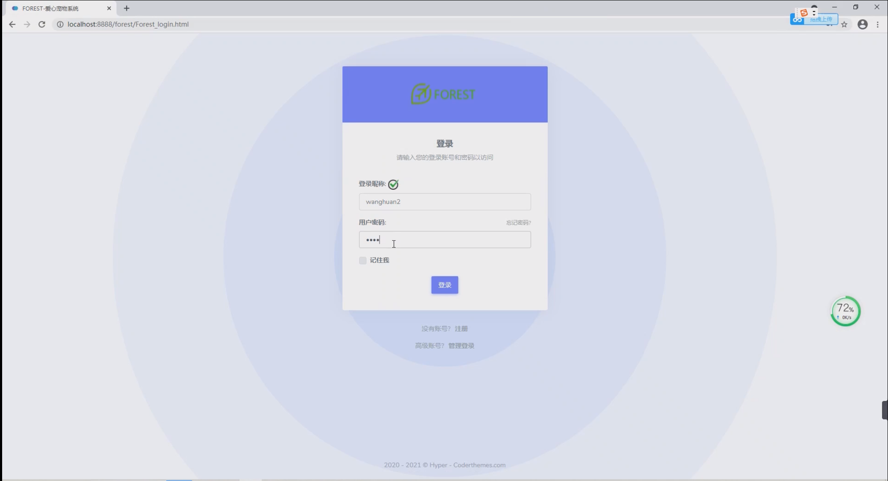
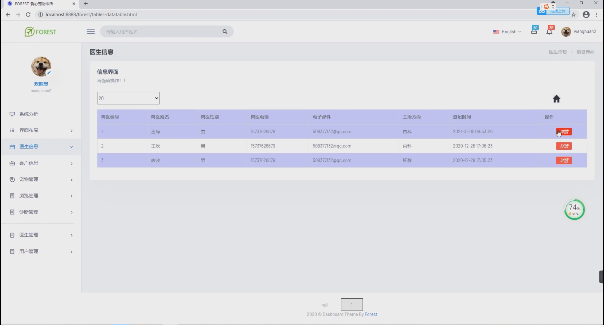
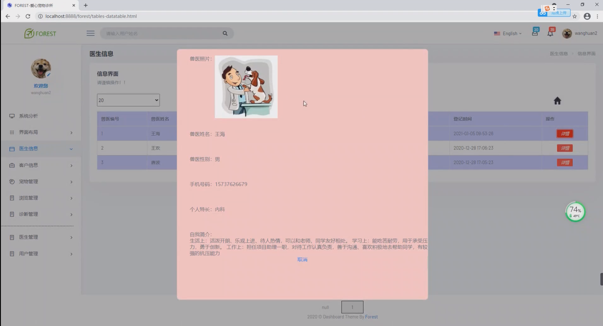
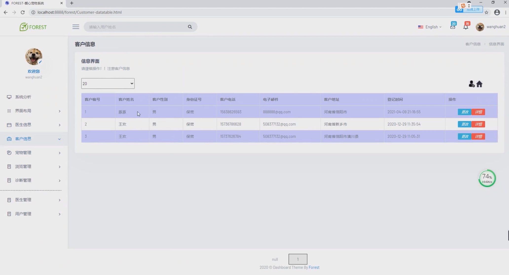
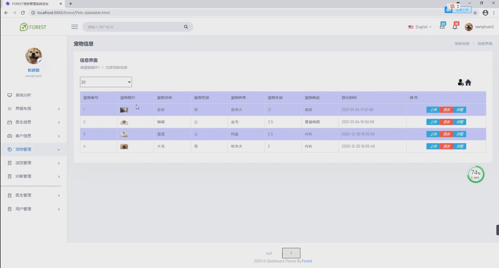
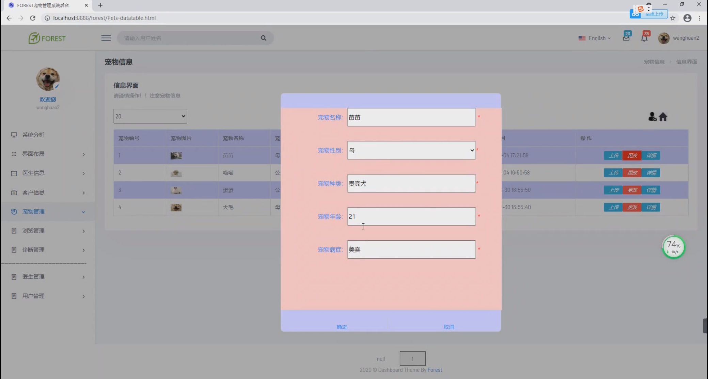
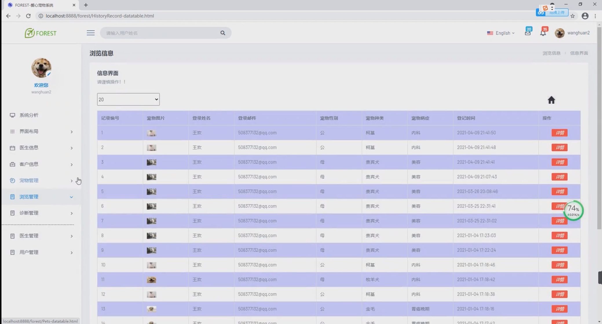
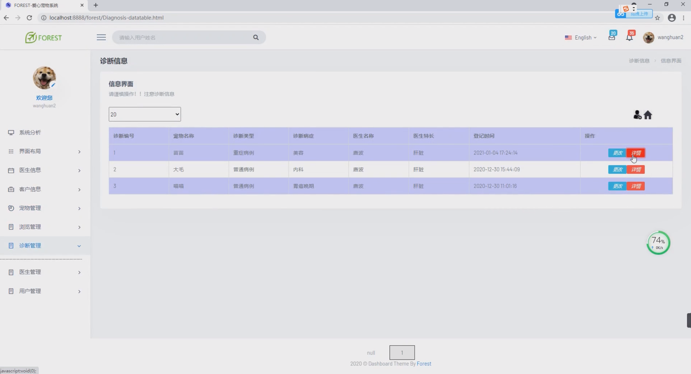
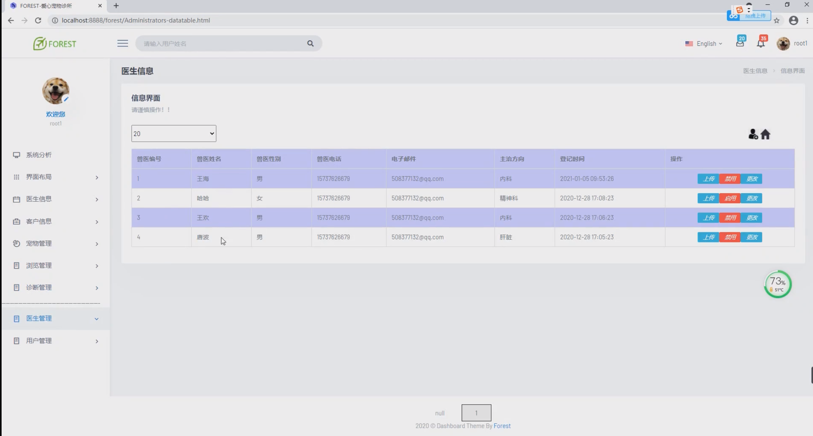

基于Springboot的宠物医院管理系统
=
### 完整代码获取地址：从戎源码网 ([https://armycodes.com/](https://armycodes.com/))
### 作者微信：19941326836  QQ：952045282 
### 承接计算机毕业设计、Java毕业设计、Python毕业设计、深度学习、机器学习
### 选题+开题报告+任务书+程序定制+安装调试+论文+答辩ppt 一条龙服务
### 所有选题地址https://github.com/nature924/allProject

一、项目介绍
---
基于Springboot框架实现的宠物医院管理系统包含两种角色：管理员、用户,系统分为前台和后台两大模块，主要功能如下。

### 【用户模块】：
1. 系统分析：用户可以浏览系统的功能和流程，了解系统的使用方法。
2. 界面布局：用户可以查看系统的界面布局，了解系统的界面设计和使用方式。
3. 医生信息：用户可以查看宠物医院的医生信息，包括医生的个人资料、专长等。
4. 客户信息：用户可以管理自己的客户信息，包括查看、编辑、删除等操作。
5. 宠物管理：用户可以管理自己的宠物信息，包括查看、编辑、删除等操作。
6. 浏览管理：用户可以浏览宠物医院的相关信息，包括医院介绍、服务内容等。
7. 诊断管理：用户可以查看宠物的诊断信息，包括诊断结果、治疗方案等。

### 【管理员模块】：
1. 系统分析：管理员可以浏览系统的功能和流程，了解系统的使用方法。
2. 界面布局：管理员可以查看系统的界面布局，了解系统的界面设计和使用方式。
3. 医生信息：管理员可以管理宠物医院的医生信息，包括新增、编辑、删除等操作。
4. 客户信息：管理员可以管理宠物医院的客户信息，包括新增、编辑、删除等操作。
5. 宠物管理：管理员可以管理宠物医院的宠物信息，包括新增、编辑、删除等操作。
6. 浏览管理：管理员可以管理宠物医院的相关信息，包括发布、编辑、删除等操作。
7. 诊断管理：管理员可以管理宠物的诊断信息，包括新增、编辑、删除等操作。
8. 医生管理：管理员可以管理医生的信息，包括查看、编辑、删除等操作。
9. 用户管理：管理员可以管理用户的信息，包括查看、编辑、删除等操作。

二、项目技术
---
- 编程语言：Java
- 数据库：MySQL
- 项目管理工具：Maven
- 前端技术：VUE、HTML、Jquery、Bootstrap
- 后端技术：Spring、SpringMVC、MyBatis

三、运行环境
---
- 操作系统：Windows、macOS都可以
- JDK版本：JDK1.8以上都可以
- 开发工具：IDEA、Ecplise、Myecplise都可以
- 数据库: MySQL5.7以上都可以
- Tomcat：任意版本都可以
- Maven：任意版本都可以

四、运行截图
---

### 程序截图：

